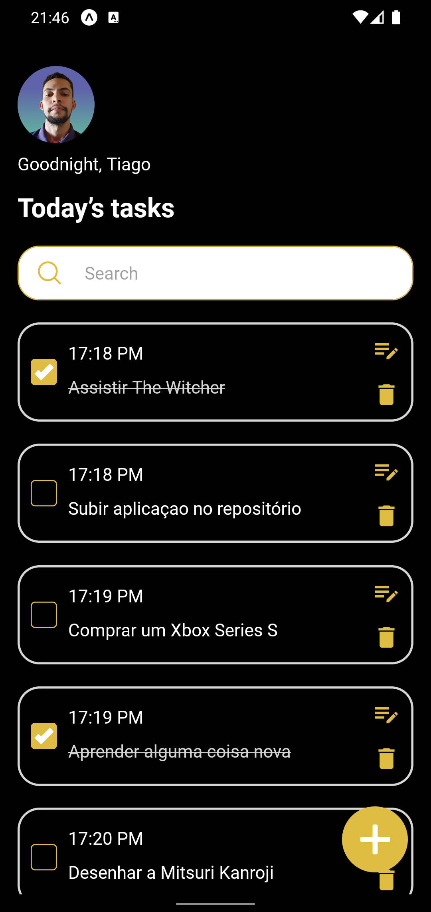

# Todolist - Mobile App

Aplicação de uma lista de tarefas, com as seguintes características, criação, listagem, atualização e deleção de tarefas, as tarefas são exibidas em tempo real, mostrando a hora da criação e sua descrição. O usuário pode interagir para concluir a tarefa ou desmarcar como incompleta, uma funcionalidade de toggle (checkbox).

## Screenshots

<div>
  
  
  
</div>

## Como rodar o projeto

Clone esse repositório `todolist` em uma pasta de sua escolha

```bash
  # clone o repositório
  git clone https://github.com/TiagoM13/todolist.git

  # abra a pasta do projeto 
  cd todolist 

  # instale as dependecias
  npm install

  # abra o projeto usando o visual studido code (ou outro editor de sua escolha) 
  code .

  # rode o projeto usando
  npx expo start
```
    
## Funcionalidades

- Criação de tarefas
- Listagem em tempo real das tarefas
- Atualização da tarefa
- Deleção da tarefa
- Salvando na mémoria do dispositivo
- Busca de tarefas


## Stack utilizada

**Front-end:** React, React Native, Expo, Expo Router, React Native AsyncStorage
